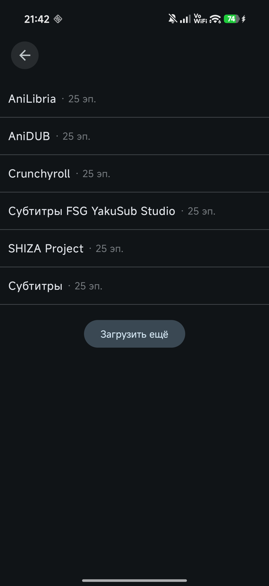
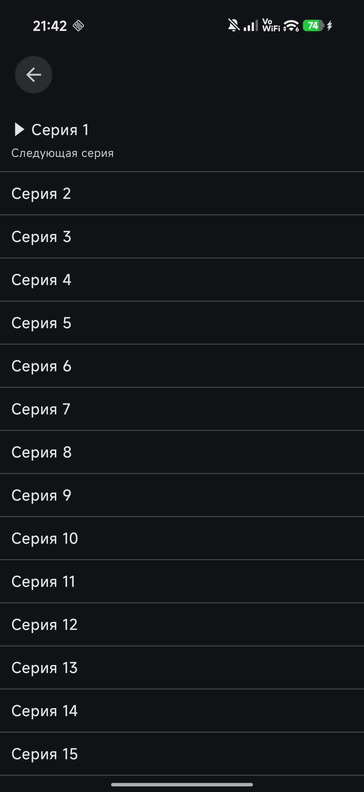
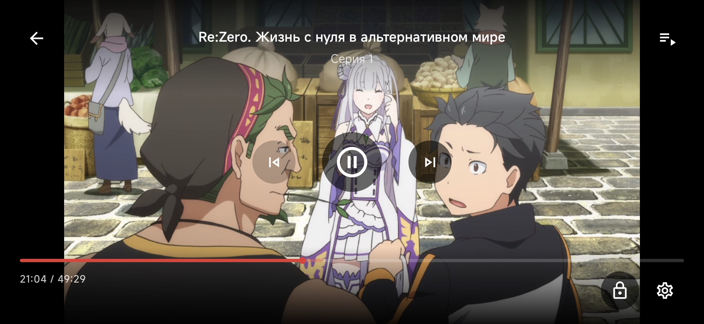

<div align="center">


# [Hibiki](https://github.com/akkirrai1337/hibiki)

[English version](README.md)

**[Hibiki](https://github.com/akkirrai1337/hibiki) — неофициальный клиент YummyAnime для Android с каталогом, поиском, страницами тайтлов, прогрессом просмотра, локальной библиотекой, встроенным плеером и поддержкой сохранённых серий. В будущем может появиться переключение источников.**


[](LICENSE)

### Основные возможности

<div align="left">

* Каталог аниме с подборками, трендами и недавними обновлениями
* Поиск по названию с фильтрами
* Подробные страницы тайтлов с постером, описанием, оценками, жанрами, скриншотами и связанными тайтлами
* Выбор источника просмотра и серии
* Встроенный Media3-плеер с поддержкой HLS, DASH и MP4
* Настройки плеера: качество, источник, вариант плеера, скорость воспроизведения, автопереход к следующей серии и пропуск опенинга/эндинга
* Сохранение прогресса просмотра и продолжение с последнего открытого тайтла
* Локальная библиотека с категориями: смотрю, запланировано, просмотрено, брошено, отложено, избранное и сохранённое
* Сохранённые серии с локальным кэшем воспроизведения
* Экран аккаунта и вход; функции профиля ещё в разработке
* Русская и английская локализация интерфейса
* Экспорт очищенных логов для баг-репортов

</div>

### Скриншоты

<div align="center">
    
    
    
    <br/>
    
    
    
    <br/>
    
</div>

### Сборка

Для репозитория рекомендуется JDK 21.

```bash
./gradlew :app:assembleDebug
```

Компиляция debug Kotlin sources:

```bash
./gradlew :app:compileDebugKotlin
```

Запуск тестов parser-модуля:

```bash
./gradlew :parsers:test
```

Windows:

```powershell
.\gradlew.bat :app:assembleDebug
```

### Реальное состояние проекта

<div align="left">

В текущем коде есть рабочий Compose UI, поиск, страницы тайтлов, сценарий источников и серий, плеер, локальная библиотека, прогресс просмотра, экран аккаунта и сохранённые серии. Некоторые функции аккаунта/профиля и настройки источников/хранилища пока остаются частично подключёнными точками интеграции.

</div>

### Что я ещё хочу реализовать

<div align="left">

- [ ] Просмотр картинка-в-картинке
- [ ] Режимы масштабирования видео: stretch, crop и fit
- [ ] Более полезный вход в YummyAnime с загрузкой данных профиля
- [ ] Полноценный экран каталога аниме
- [ ] Больше идей позже

</div>

### Связь

<div align="left">

По вопросам, предложениям или баг-репортам можно написать мне в Discord: `akkirrai`

</div>

### Лицензия

<div align="left">

Hibiki распространяется под лицензией [GNU General Public License v3.0](LICENSE).

</div>

### Disclaimer

<div align="left">

Hibiki не связан с YummyAnime и не является официальным приложением YummyAnime. Сейчас приложение работает как клиент YummyAnime; в будущем может появиться переключение источников. Доступность некоторых функций зависит от внешних источников данных и локального кэширования.

</div>

</div>
