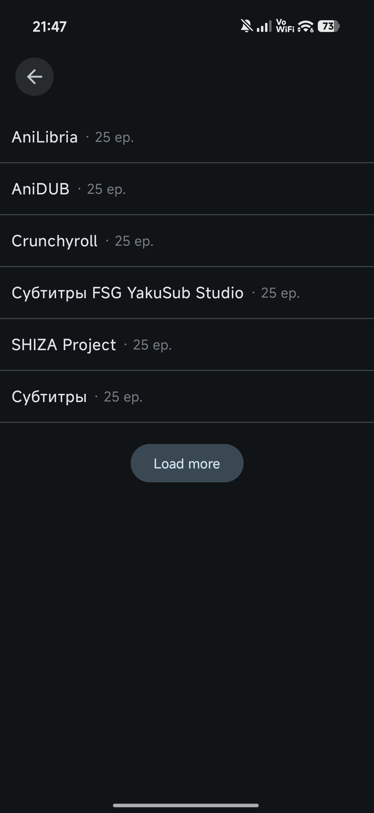
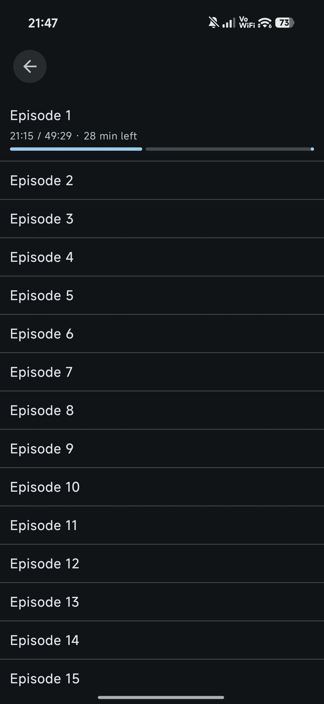
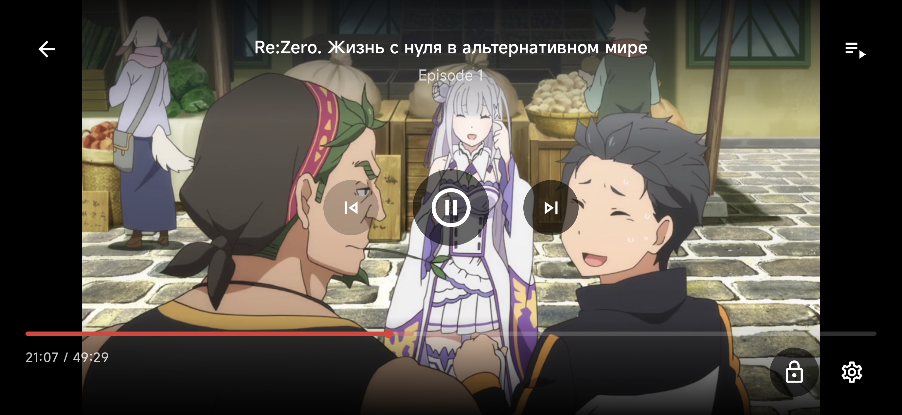

<div align="center">


# [Hibiki](https://github.com/akkirrai1337/hibiki)

[Русская версия](README_RU.md)

**Hibiki is an unofficial YummyAnime client for Android with catalog browsing, search, title pages, watch progress, a local library, a built-in player, and saved episode support. Source switching may be added in the future.**


[](LICENSE)

### Main Features

<div align="left">

* Anime catalog with featured titles, trending titles, and recent updates
* Search by title with filters
* Detailed title pages with poster, description, ratings, genres, screenshots and related titles
* Watch source and episode selection
* Built-in Media3 player with HLS, DASH and MP4 support
* Player settings: quality, source, player option, playback speed, autoplay next episode and opening/ending skip
* Watch progress saving and continue watching from the last viewed title
* Local library with categories: watching, planned, completed, dropped, on hold, favorite and saved
* Saved episodes with local playback cache
* Account screen and sign-in flow; profile-related features are still in progress
* Russian and English interface localization
* Sanitized log export for bug reports

</div>

### In-App Screenshots

<div align="center">
    
    
    
    
    
    
    
</div>

### Build

<div align="left">

JDK 21 is recommended.

```bash
./gradlew :app:assembleDebug
```

Run parser tests:

```bash
./gradlew :parsers:test
```

Windows:

```powershell
.\gradlew.bat :app:assembleDebug
```

</div>

### Project State

<div align="left">

The current codebase contains a working Compose UI, search, title pages, source and episode flow, player, local library, watch progress, account screen and saved episode pipeline. Some account/profile and source/storage features are still partial integration points.

</div>

### Planned Ideas

<div align="left">

- [ ] Picture-in-picture playback
- [ ] Video scaling modes: stretch, crop and fit
- [ ] More useful YummyAnime sign-in with profile data loading
- [ ] Full anime catalog screen
- [ ] More ideas later

</div>

### License

<div align="left">

Hibiki is licensed under the [GNU General Public License v3.0](LICENSE).

</div>

### Disclaimer

<div align="left">

Hibiki is not affiliated with YummyAnime and is not an official YummyAnime application. The app currently works as a YummyAnime client; source switching may be added in the future. Availability of some features depends on external data sources and local caching.

</div>

</div>
