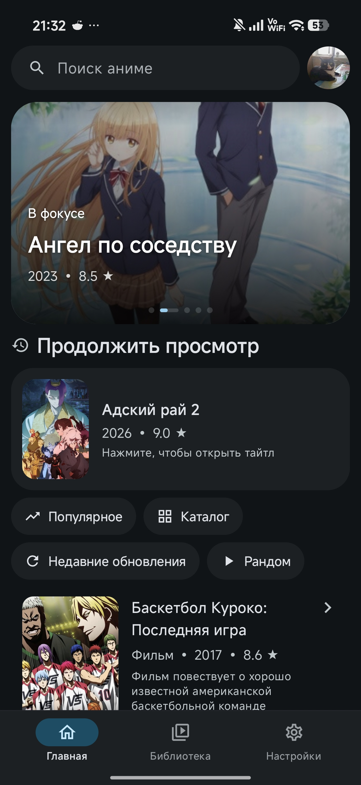
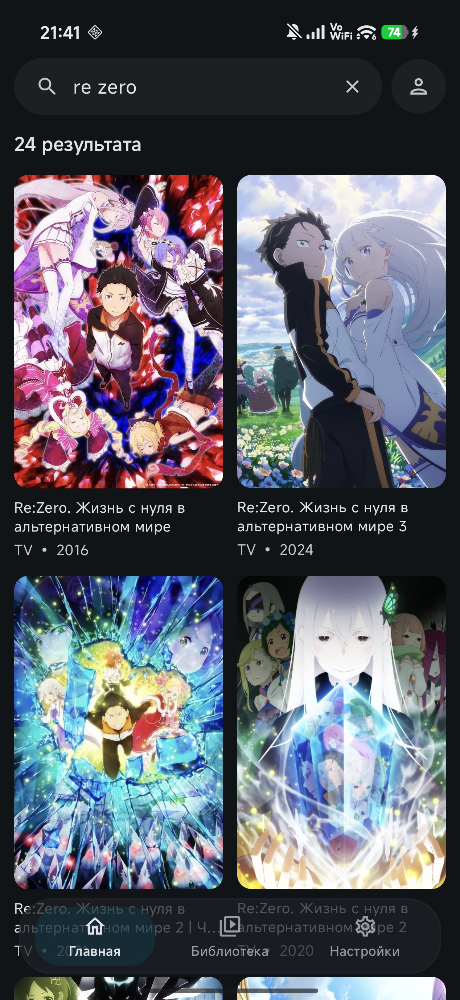
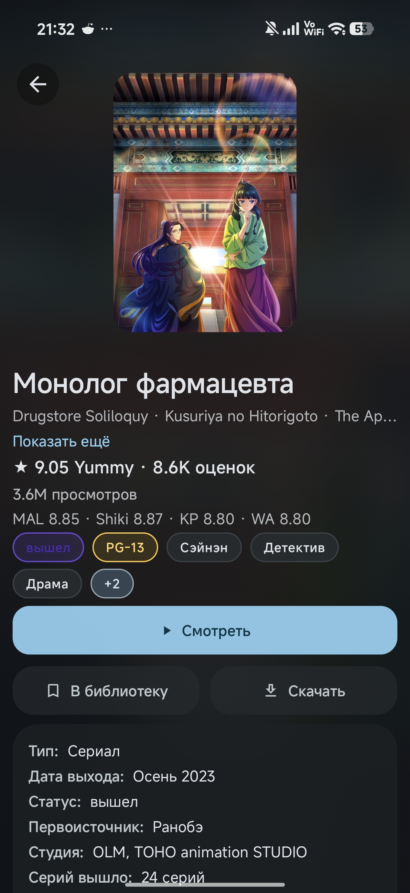
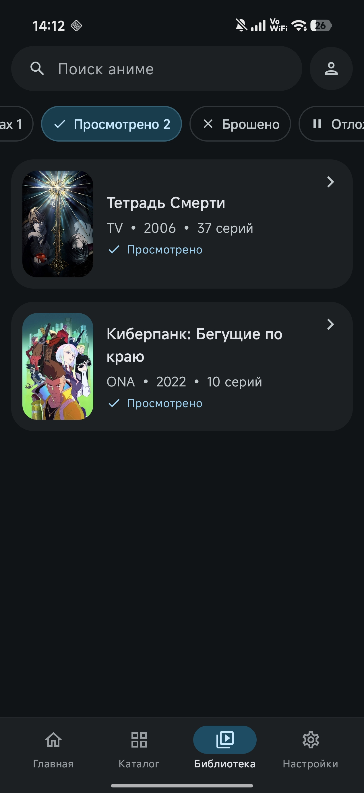

  

  # hibiki

  [English version](README_EN.md)

  **hibiki — неофициальный клиент YummyAnime для Android с каталогом, поиском, страницами тайтлов, прогрессом просмотра, локальной библиотекой, встроенным плеером и поддержкой сохранённых серий. В будущем может появиться переключение источников.**

  
  
  
  

### 📚 Основные возможности

* Каталог аниме с подборками, трендами и недавними обновлениями
* Поиск по названию с фильтрами
* Подробные страницы тайтлов с постером, описанием, оценками, жанрами, скриншотами и связанными тайтлами
* Выбор источника просмотра и серии
* Встроенный Media3-плеер с поддержкой HLS, DASH и MP4
* Настройки плеера: качество, источник, вариант плеера, скорость воспроизведения, автопереход к следующей серии и пропуск опенинга/эндинга
* Сохранение прогресса просмотра и продолжение с последнего открытого тайтла
* Локальная библиотека с категориями: смотрю, запланировано, просмотрено, брошено, отложено, избранное и сохранённое
* Сохранённые серии с локальным кэшем воспроизведения
* Экран аккаунта и вход; функции профиля ещё в разработке
* Русская и английская локализация интерфейса

### 🖼️ Скриншоты

    
    
     
    
    

### 🎬 Credits

- 🎬 [anilibria-app](https://github.com/anilibria/anilibria-app): иконки для плеера.

### 💬 Связь

По вопросам, предложениям или баг-репортам можно написать мне в Discord: `akkirrai`

### 📄 Лицензия

hibiki распространяется под лицензией [GNU General Public License v3.0](LICENSE).

### ⚖️ DMCA Disclaimer

Разработчик этого приложения не аффилирован с контентом, доступным в приложении, и не хранит и не распространяет этот контент. Приложение следует рассматривать как веб-браузер: всё содержимое, доступное через него, свободно доступно в интернете. Все запросы на удаление контента по DMCA следует направлять владельцам сайта, на котором этот контент размещён.
