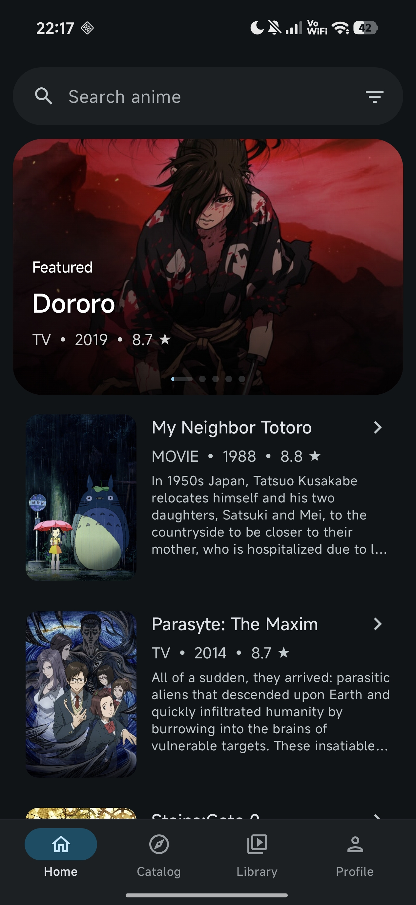
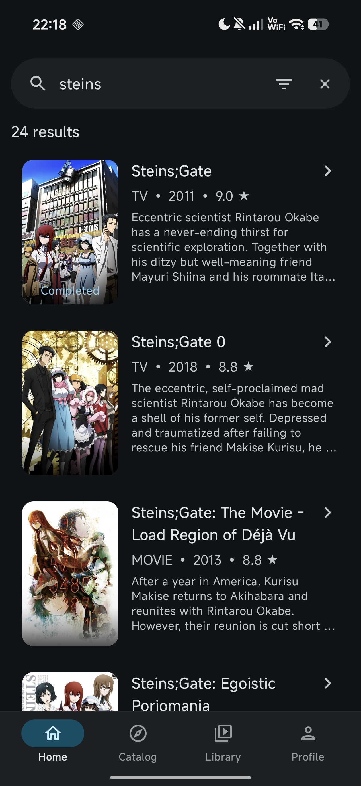
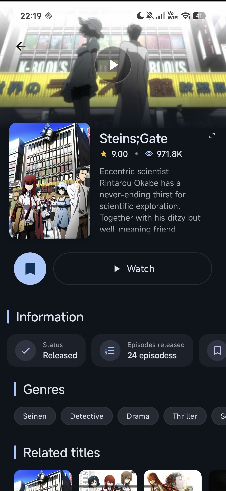
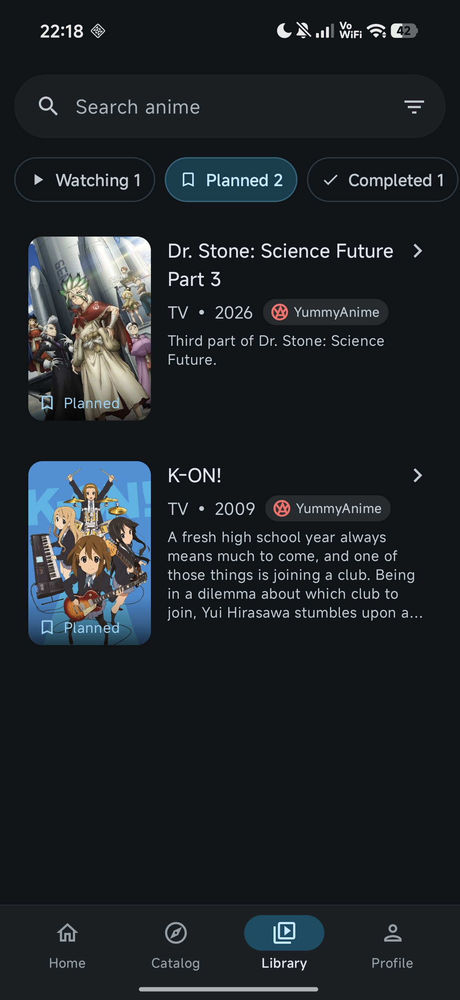

  

  # hibiki

  [Русский](README_RU.md)

  **hibiki is an Android app for browsing and watching anime from selectable sources. It combines a catalog, search, a local library, offline downloads, and a built-in player, while keeping your watch progress and profile data on the device.**

  
  
  
  

### 📚 Features

* Switchable anime sources, with source-aware catalog, search, filters, and sorting
* Detailed title pages with descriptions, genres, related and similar titles
* Episode and voice-over selection
* Built-in Media3 player with HLS, DASH, and MP4 support
* Playback controls: quality, player engine, speed, autoplay, and opening/ending skip
* Watch progress, continue watching, and a local profile with viewing statistics
* Local library: watching, planned, completed, dropped, on hold, favourites, and downloads
* Offline episode downloads and playback
* Light, dark, system, and AMOLED themes
* Russian and English app languages
* Optional Discord Rich Presence

### 🖼️ Screenshots

    
    
     
    
    

### 🎬 Credits

- [anilibria-app](https://github.com/anilibria/anilibria-app): player icons.
- [Animite](https://github.com/imashnake0/Animite): references for the title page's dynamic palette and UI behavior, countdown styling, and the hourglass icon.
- [AniSync](https://github.com/Marco-9456/AniSync): title page design and styling references.

### 💬 Contact

For questions, suggestions, or bug reports, you can contact me on Discord: `akkirrai`

### 📄 License

hibiki is licensed under the [GNU General Public License v3.0](LICENSE).

### ⚖️ DMCA Disclaimer

The developer of this application does not have any affiliation with the content available in the app and does not store or distribute any content. This application should be considered a web browser, and all content that can be found using this application is freely available on the Internet. All DMCA takedown requests should be sent to the owners of the website where the content is hosted.
