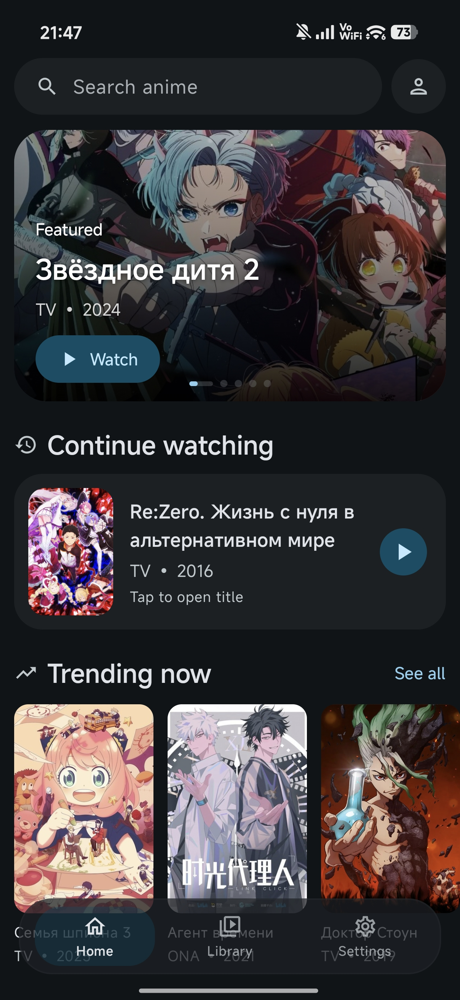
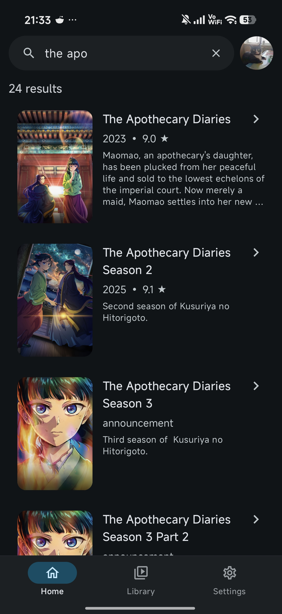
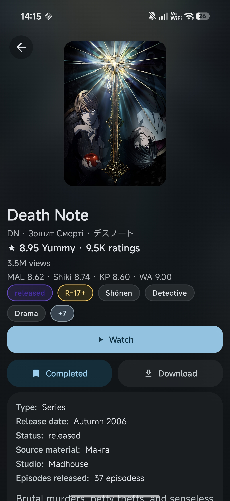
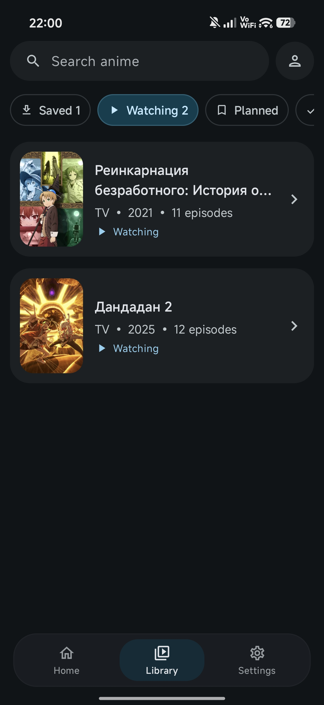

  

  # hibiki

  [Русская версия](README.md)

  **hibiki is an unofficial YummyAnime client for Android with catalog browsing, search, title pages, watch progress, a local library, a built-in player, and saved episode support. Source switching may be added in the future.**

  
  
  
  

### 📚 Features

* Anime catalog with featured titles, trending titles, and recent updates
* Search by title with filters
* Detailed title pages with poster, description, ratings, genres, screenshots and related titles
* Watch source and episode selection
* Built-in Media3 player with HLS, DASH and MP4 support
* Player settings: quality, source, player option, playback speed, autoplay next episode and opening/ending skip
* Watch progress saving and continue watching from the last viewed title
* Local library with categories: watching, planned, completed, dropped, on hold, favorite and saved
* Saved episodes with local playback cache
* Account screen and sign-in flow; profile-related features are still in progress
* Russian and English interface localization

### 🖼️ Screenshots

    
    
     
    
    

### 🎬 Credits

- 🎬 [anilibria-app](https://github.com/anilibria/anilibria-app): player icons.

### 💬 Contact

For questions, suggestions, or bug reports, you can contact me on Discord: `akkirrai`

### 📄 License

hibiki is licensed under the [GNU General Public License v3.0](LICENSE).

### ⚖️ DMCA Disclaimer

The developer of this application does not have any affiliation with the content available in the app and does not store or distribute any content. This application should be considered a web browser, and all content that can be found using this application is freely available on the Internet. All DMCA takedown requests should be sent to the owners of the website where the content is hosted.
